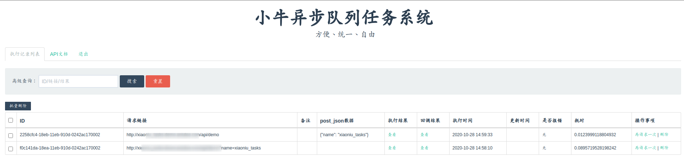
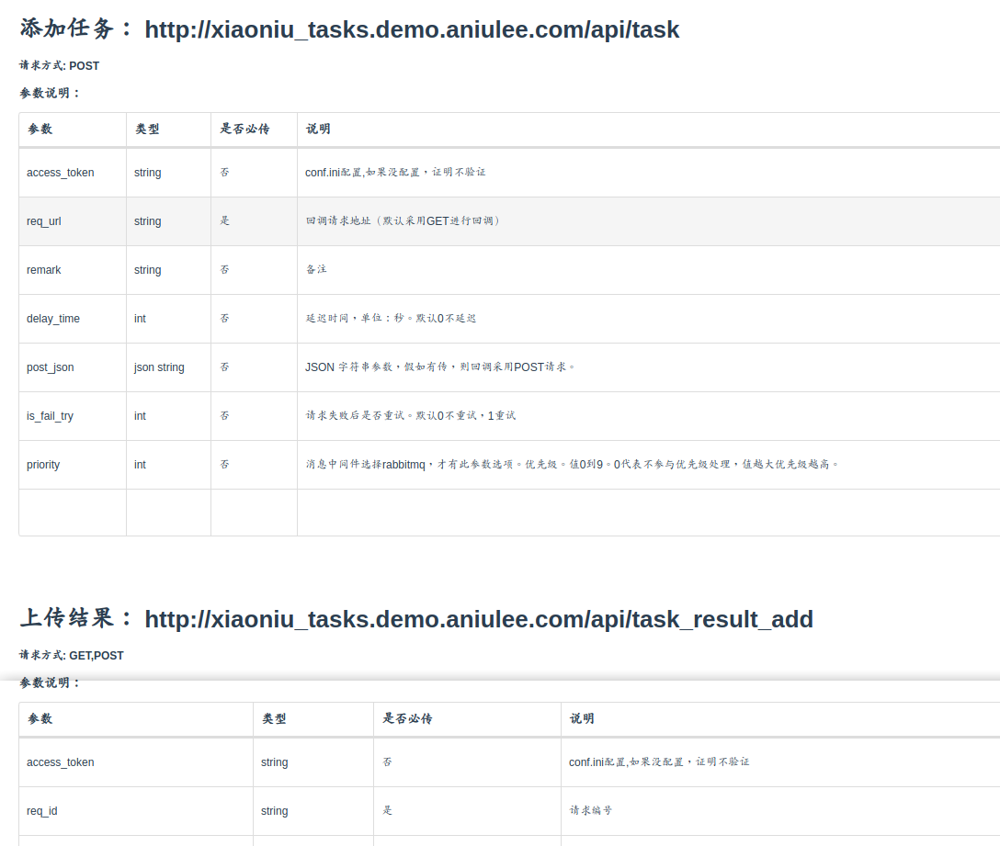

# 小牛异步队列任务系统（xiaoniu_tasks）


### 特性

* 支持集群

* 可视化界面操作

* 支持API动态调用

* 支持延迟调用

* 支持优先级调用

* 任务可搜索、编辑、删除,失败可重试

* 支持查看日志

* BUG及时通知

* Docker 一键安装，方便使用

[体验地址](http://xiaoniu_tasks.demo.aniulee.com/ "体验地址")


### 一、基本配置(conf.ini 文件)
```ini
[default]
#消息中间件 支持redis amq
celery_broker_url=redis://:{密码}@127.0.0.1:6379/10
#存储数据库
celery_job_log_db_url=sqlite:////home/www/xiaoniu_db.sqlite
#网页登录密码
login_pwd=123456
#通知api_key https://www.aniulee.com/#/wx_push_setting
#支持BUG通知
error_notice_api_key=
#回调结果 包含fail就通知，关键词可多个 ,隔开
error_keyword=fail
#日志保存条数
job_log_counts = 1000
#为api保驾护航
api_access_token =
#失败重试 回调请求失败后 10秒后再请求，如果请求再失败过20秒再请求 以此类推
retry_times=10,20,30
```

### 二、修改docker-compose.yml 文件
1. 项目地址
2. 端口号


[]()
### 三、docker 一键安装
```shell script
sudo docker-compose up --build -d
```
具体docker,docker-compose怎么安装，自行谷歌，百度。

### 四、开始使用
> 访问链接 http://{ip}:{docker-compose.yml设置的端口}


* 请求记录列表

[]()

* 通过api调用 

[]()


### 五、简单例子

* 下单5分钟内如果没支付，这个订单就取消。

* 发短信

。。。

[更多例子设置参考](https://www.aniulee.com/#/details?id=260 "更多例子")

### 七、关于本人

[aniulee博客](https://www.aniulee.com "aniulee博客")

[小牛定时任务管理](https://github.com/aniu-lee/xiaoniu_cron "小牛定时任务管理")

[两分钟内实现实时推送](https://www.aniulee.com/#/wx_push_setting "两分钟内实现实时推送")


#### 如果感觉项目还不错，有帮到您，来颗星，感谢！

#### 开源不易，欢迎大佬赏杯茶。
[]()
